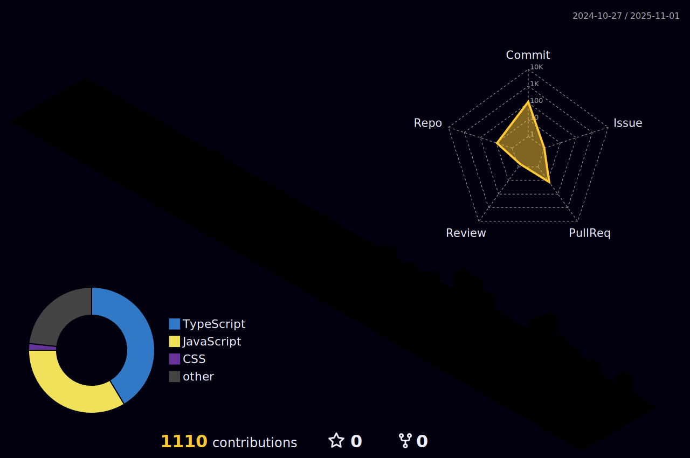

<!-- Profile Header -->

  

  <h1>Hi, I'm Siddharth 👋</h1>
  <h3><i>Confusion is a part of recursion</i></h3>

---

### 👨🏻‍💻 About Me
A Computer Science graduate passionate about **systems programming, low-latency infrastructure, and security**.  
I have hands-on experience with **full-stack development** and **cloud platforms (AWS)**, and I’m eager to contribute to **high-performance environments** through efficient code and technical excellence.

- 🔭 Currently building full-stack apps with **React.js, Node.js, MongoDB** deployed on **AWS**  
- 🌱 Exploring **Cybersecurity** (secure networks, common vulnerabilities)  
- 💬 Ask me about **AWS, MERN Stack, Systems Programming, Cybersecurity**  
- 📫 Reach me: **siddharth25op@gmail.com**

---

### 📊 GitHub Stats

| Stats | Streak | Languages |
|-------|--------|-----------|
|  |  |  |

---

### 🏆 Achievements

  

---

### 🎧 Now Playing on Spotify

---

### 🚀 My Projects
| Project | Description |
|---------|-------------|
| **PhishWatch** | Detects phishing websites in real-time using Google Generative AI. Built with **Next.js + Tailwind + TypeScript**. |
| **Obsidian Pass** | Full-stack password manager with client-side **AES encryption** & **bcrypt** authentication. |
| **Blog App** | Blogging platform with CRUD, role-based access, and rich text editor. Built using **React + Firebase + MongoDB**. |

---

### 🛠️ Tech Stack

  

---

### 📜 Certifications & Learning
- **AWS Certified Cloud Practitioner (CLF-C02)** – Understanding of AWS services & cloud infrastructure  
- **Full-Stack Development** – Web apps using **HTML, CSS, JavaScript, Node.js, MongoDB**  
- **Networking & System Administration** – CCNA-level networking, Linux/Windows admin  
- **Competitive Programming** – Solved 150+ problems on **LeetCode** (DSA expertise)  

---

### 🤝 Connect With Me

  
  

---

